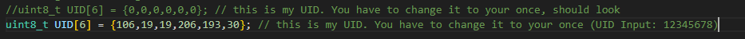
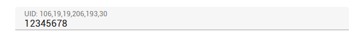
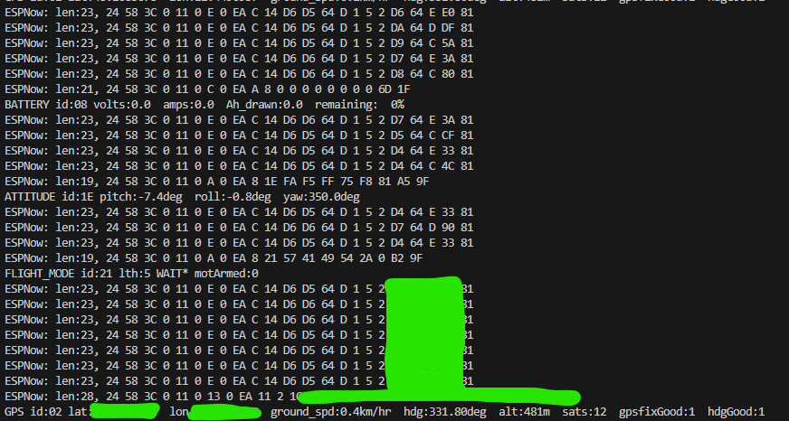

# ELRS Backpack send data via ESPNOW to ESP8266/ESP32 
 Backpack Expresslrs Example with ESP8266/ESP32 and CRSF Protokoll

# Config the sketch:
 * On the website https://expresslrs.github.io/web-flasher/, the private UID must be generated (using the same password as the ELRS system).
 * This UID must be entered in the sketch under ``` uint8_t UID[6] = {106,19,19,206,193,30};```.

 * In the ELRS Backpack, Telemetry ESPNOW must be enabled (tested with Backpack version 1.5.1).

 * A telemetry connection between the transmitter and, for example, the drone/flight controller must be established.

 
 
 
