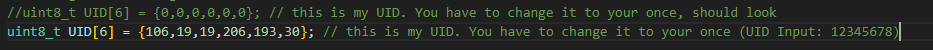
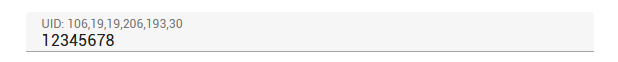
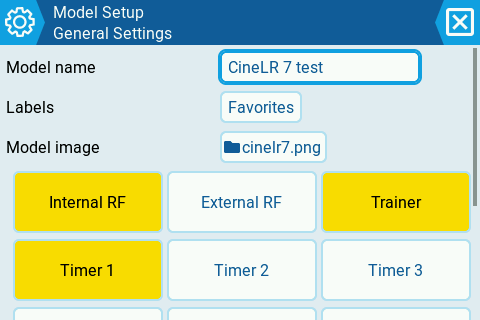
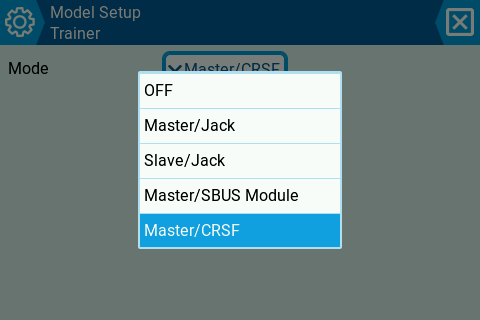
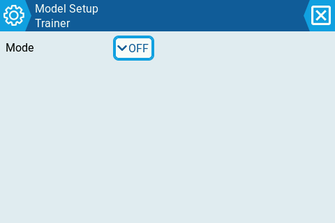
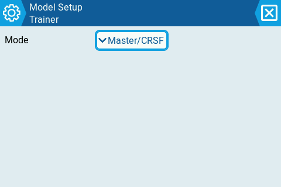
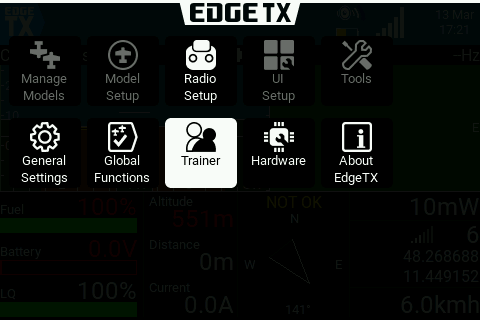
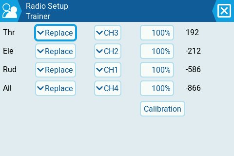
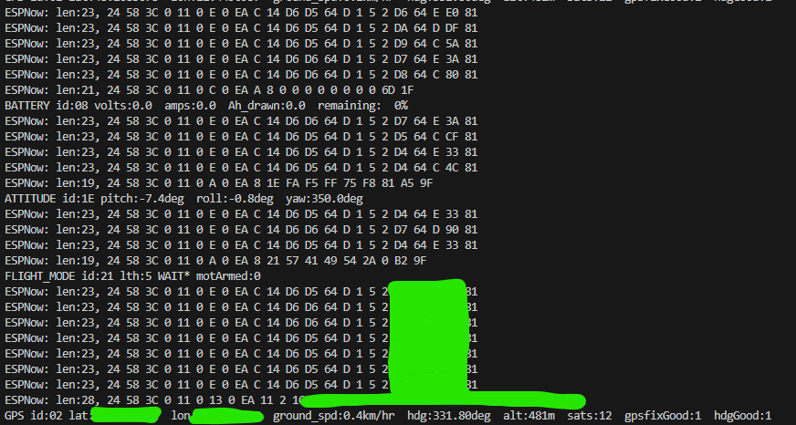

# 🚀 ELRS Backpack ESP-NOW Bridge (ESP8266 / ESP32)

---

# 🇺🇸 English Version

## 📡 Overview

This project is a **bidirectional ESP-NOW bridge** for the **ExpressLRS Backpack** system.

Supported boards:
- ✅ ESP8266
- ✅ ESP32
- ✅ ESP32-C3

### Features

- 📥 Receive CRSF data via ESP-NOW
- 📤 Send data back via ESP-NOW
- 🎮 Trainer Mode support (EdgeTX / CRSF)
- 🧭 Fake VRX / Trainer simulation support
- 🛰 MSP packet handling
- 🔄 Channel ramp / signal test example
- 📝 Advanced debug logging
- 🔐 UID-based secure peer configuration
- ⚡ Works with ELRS Backpack telemetry

---

## 🔑 UID Configuration (Required)

Generate your UID using:

https://expresslrs.github.io/web-flasher/

Use the same binding phrase as your ELRS system.

Insert the generated UID into:

```cpp
uint8_t UID[6] = { ... };
```

 
 

---

## 📡 ELRS Backpack Setup

On the Backpack:

- ✅ Enable **Telemetry via ESP-NOW**
- Tested with Backpack firmware 1.5.1+
- Ensure correct binding phrase

---

## 🎮 Trainer Mode (IMPORTANT)

Official documentation:

https://www.expresslrs.org/software/trainer-input/

### Important Notes:

- Trainer mode must be set to **Master / CRSF**
- Required even if:
  - Aux channels are configured in ELRS Lua
  - Headtracking is used in EdgeTX
- Sometimes you must:
  - Restart the transmitter
  - Switch Trainer Mode multiple times
- It may happen that:
  - 📡 Telemetry works
  - 🎮 Trainer signal is not detected
  - → Re-selecting Master/CRSF can fix it

This behavior can be normal in some ELRS setups.

### Step 1


### Step 2


### Step 3


### Step 4


### Step 5


### Step 6


---

## 📌 Summary

This project enables:

🔥 Full ESP-NOW communication  
🔥 Bidirectional CRSF data handling  
🔥 Trainer Mode integration  
🔥 Fake VRX support  

Between:
- ELRS Backpack
- ESP8266 / ESP32
- EdgeTX systems

 
 
---

# 🇩🇪 Deutsche Version

## 📡 Übersicht

Dieses Projekt ist eine **bidirektionale ESP-NOW Bridge** für das **ExpressLRS Backpack System**.

Unterstützte Boards:
- ✅ ESP8266
- ✅ ESP32
- ✅ ESP32-C3

### Funktionen

- 📥 CRSF Daten über ESP-NOW empfangen
- 📤 Daten über ESP-NOW senden
- 🎮 Trainer Mode Unterstützung (EdgeTX / CRSF)
- 🧭 Fake VRX / Trainer Simulation
- 🛰 MSP Paket Verarbeitung
- 🔄 Channel Ramp / Test-Wave Beispiel
- 📝 Umfangreiches Debug Logging
- 🔐 UID-basierte Peer Konfiguration
- ⚡ Telemetrie Support für ELRS Backpack

### Step 1


### Step 2


### Step 3


### Step 4


### Step 5


### Step 6


---

## 🔑 UID Konfiguration (Pflicht)

UID erzeugen über:

https://expresslrs.github.io/web-flasher/

Gleiche Binding Phrase wie im ELRS System verwenden.

UID eintragen in:

```cpp
uint8_t UID[6] = { ... };
```

 
 
 
---

## 📡 Backpack Einstellungen

Im ELRS Backpack:

- ✅ **Telemetry via ESP-NOW aktivieren**
- Getestet mit Firmware 1.5.1+
- Binding Phrase muss korrekt sein

---

## 🎮 Trainer Modus (WICHTIG)

Offizielle Anleitung:

https://www.expresslrs.org/software/trainer-input/

### Wichtige Hinweise:

- Trainer Mode muss auf **Master / CRSF** stehen
- Auch wenn:
  - Aux Kanäle im ELRS Lua genutzt werden
  - Headtracking in EdgeTX aktiv ist
- Manchmal muss man:
  - Den Sender neu starten
  - Den Trainer Modus mehrfach umstellen
- Es kann vorkommen, dass:
  - 📡 Telemetrie funktioniert
  - 🎮 Trainer Signal nicht ankommt
  - → Mehrfaches Umschalten auf Master/CRSF hilft

Dieses Verhalten ist bei manchen ELRS Setups normal.

---

## 📌 Zusammenfassung

Dieses Projekt ermöglicht:

🔥 Vollständige ESP-NOW Kommunikation  
🔥 Bidirektionale CRSF Verarbeitung  
🔥 Trainer Mode Integration  
🔥 Fake VRX Unterstützung  

Zwischen:
- ELRS Backpack
- ESP8266 / ESP32
- EdgeTX Systemen

 